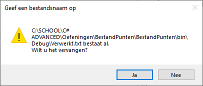
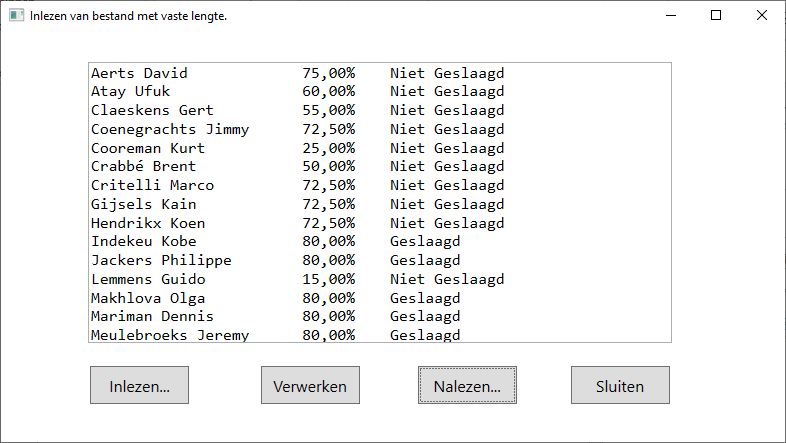

Maak een applicatie om de gegevens in te lezen, de punten te verwerken en de resultaten terug weg te schrijven.

Je maakt voor deze toepassing eerst de (basis)klasse **PuntenAdmin** met volgende [eigenschappen]:
-   **Familyname** - string
-   **Firstname** -- string
-   **Gender** - string
-   **Email** -- string
-   **Score** -- integer (behaalde punten)
-   **TotalScore** -- integer (puntentotaal)

De klasse Punten bevat volgende [methods]:
-   Constructor **PuntenAdmin** in 2 vormen: één zonder parameters waarbij een lege klasse gecreëerd wordt en één met 6 parameters (de 6 eerder beschreven eigenschappen).
-   **Percent --** float (berekent het behaald percentage vb. 72,50%)
-   **Grade** -- string (geeft "Geslaagd" als je min. 80% hebt anders "Niet geslaagd")

De knop *Inlezen* leest o.b.v. een OpenFileDialog een bestand in. Van elk record in dit bestand wordt een instance gemaakt van de klasse PuntenAdmin. Elk object dat je aanmaakt voeg je toe aan een List\<\> van het type PuntenAdmin. Je toont de ingelezen gegevens in het tekstvak *resultTextBox*. Na het inlezen worden de opdrachtknoppen *Verwerken* en *Nalezen* zichtbaar.

Door middel van de opdrachtknop *Verwerken* moet een nieuw tekstbestand *PuntenVerwerkt.txt* met vaste lengte worden gemaakt. Het bestand bestaat uit de naam, het behaald resultaat in percentage (eerste 3 cijfers van 4de kolom/laatste 3 cijfers van 4de kolom) en de melding Geslaagd of Niet geslaagd. Een cursist is slechts geslaagd wanneer er minimum 85% van de punten behaald is.

Bij het overschrijven van het bestand wordt de gebruiker gevraagd om dit te bevestigen. Wanneer het bestand is verwerkt en weggeschreven, verschijnt een berichtenvenster dat het bestand nagelezen kan worden.

De opdrachtknop *Nalezen* opent het dialoogvenster *OpenFileDialog* zodat het bestand *PuntenVerwerkt.txt* kan gelezen worden in het tekstvak *TxtResulaat*.

